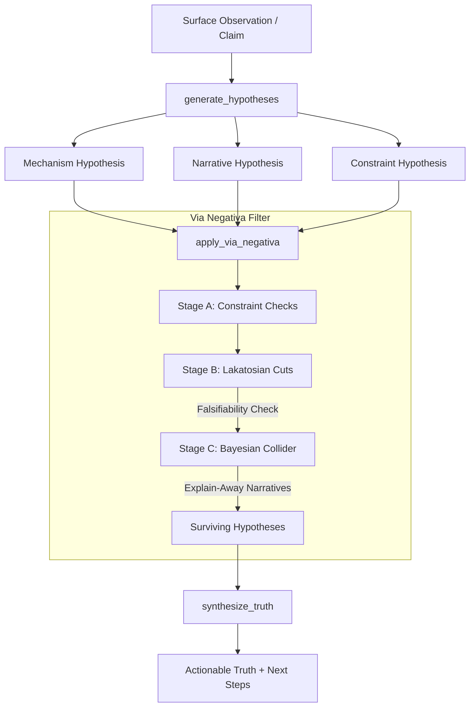

# Wisdom Engine

A Model Context Protocol (MCP) server for epistemic filtering via **Via Negativa** — hypothesis generation, subtraction, and truth synthesis.

The Wisdom Engine implements an advanced, agent-centric pipeline that filters out false narratives and ad-hoc assumptions to discover structural mechanisms, logical limits, and actionable truths.

---

## Architecture Overview



### How LLM Calls Work

The engine resolves an LLM backend at call time, **first available wins**:

1. **MCP sampling** — borrows the connected client's LLM via `sampling/createMessage`, but *only* if the client declared the `sampling` capability during initialization. Most clients (including Claude Desktop) do **not** support this; VS Code/Copilot is the main one that does.
2. **OpenRouter** — direct API call, enabled when `OPENROUTER_API_KEY` is set in the server's environment.
3. **Ollama** — local model, enabled when an Ollama server is reachable.

If no backend is available, every tool **fails loudly** with a clear error. The engine never fabricates results: a check that did not run never counts as a check that passed, and no placeholder hypotheses or syntheses are ever produced. Every tool's JSON output includes an `llm_backend` field so you can see which backend produced the reasoning.

### Configuration

Settings come from two places, in order of precedence:

1. **OS environment variables** — always win. Keep secrets here, e.g. `export OPENROUTER_API_KEY="sk-or-..."` in `~/.profile`.
2. **`.env` file in the project root** — non-secret settings. Copy `.env.example` to `.env` (git-ignored) and edit. Loaded at server startup without overriding the OS environment.

| Variable | Purpose | Default |
|---|---|---|
| `OPENROUTER_API_KEY` | Enables the OpenRouter backend (OS env, secret) | unset (disabled) |
| `OPENROUTER_MODEL` | OpenRouter model slug | `openrouter/auto` |
| `OPENROUTER_BASE_URL` | API base URL | `https://openrouter.ai/api/v1` |
| `OLLAMA_HOST` | Ollama server address | `http://localhost:11434` |
| `OLLAMA_MODEL` | Local model to use | first installed model |
| `WISDOM_TRANSPORT` | `stdio` or `streamable-http` | `stdio` |
| `WISDOM_HTTP_HOST` / `WISDOM_HTTP_PORT` | HTTP bind address (http transport only) | `127.0.0.1` / `8765` |

**Transport:** stdio is the default and right for most setups — each client spawns its own instance; the server is stateless so that's free. Set `WISDOM_TRANSPORT=streamable-http` only if you want one long-running server shared by multiple clients (endpoint: `http://127.0.0.1:8765/mcp`). Keep it bound to localhost — there's no auth layer.

> **Note (GUI-launched clients):** apps like Claude Desktop may not inherit variables exported only in your shell rc files. On Linux, export the key in `~/.profile` (picked up by the desktop session) or set it via `systemctl --user set-environment`. If the key still doesn't reach the server, putting it in `.env` works as a fallback — the file is git-ignored.

### 1. Hypothesis Generation (`generate_hypotheses`)
Given a surface symptom, the engine fans out to three distinct perspectives:
- **Mechanism (How does it work?):** Physical, technical, or systemic causes.
- **Narrative (Why do we think it works?):** Social, cognitive, or psychological stories that make it seem true.
- **Constraint (What are the hard limits?):** Boundary conditions, resource bounds, or logical limits.

Each hypothesis is automatically mapped at three recursion depths:
- **d1 (Symptom):** The surface-level observation.
- **d2 (Mechanism):** The underlying causal explanation.
- **d3 (Invariant):** The fundamental law or boundary condition supporting it.

### 2. Subtraction Engine (`apply_via_negativa`)
The core Via Negativa filter eliminates weak hypotheses through three stages:
- **Stage A (Constraint checks):** Checks if the hypothesis violates known invariants. **Skipped entirely when no constraints are provided** — an LLM asked to find violations of nothing tends to hallucinate some.
- **Stage B (Lakatosian cuts):** Cuts degenerating research programs that require ad-hoc defensive assertions to survive or are non-falsifiable.
- **Stage C (Bayesian collider):** Stronger mechanistic explanations explain away competing narratives that share the same symptom. This is intentionally asymmetric (mechanisms explain away narratives, never the reverse) — when the social dynamic *is* the mechanism, encode it in the mechanism hypothesis directly.

### 3. Truth Synthesis (`synthesize_truth`)
Compresses surviving hypotheses into an actionable path forward.
- **Structural Confidence:** Confidence is mathematically derived from the hypothesis survival rate ($\text{survivors} / \text{total}$), rather than the LLM's self-assessment. Because stages fail loudly, a reported confidence always reflects checks that actually ran.

---

## MCP Tools Exposed

### 1. `generate_hypotheses`
Proposes three competing hypotheses from mechanism, narrative, and constraint perspectives.
- **Arguments:**
  - `surface_symptom` (string, required): The observation or problem.
  - `context` (string, optional): Supporting context from research.

### 2. `apply_via_negativa`
Filters hypotheses through constraint checking, Lakatosian cuts, and Bayesian collider checks.
- **Arguments:**
  - `surface_symptom` (string, required): The original observation.
  - `hypotheses` (array, required): List of hypothesis dicts (output from `generate_hypotheses`).
  - `known_constraints` (array, optional): Physical or domain constraints. Stage A only runs when provided.

### 3. `synthesize_truth`
Synthesizes the surviving hypotheses into a clear, actionable sentence.
- **Arguments:**
  - `filter_result` (dict, required): Output from `apply_via_negativa`.

---

## Installation & Setup

Ensure you have [uv](https://github.com/astral-sh/uv) installed.

### Run Locally
To run the server in development mode, start it via `stdio` transport:
```bash
uv run wisdom-engine
```

### Run Tests
The codebase includes a fully-featured async test suite.
```bash
uv run pytest
```

---

## MCP Integration Configuration

To use the Wisdom Engine with an MCP-compatible client, add the server configuration to your client's config file.

### Example Configuration
See `mcp_config_example.json` in the root of this project:
```json
{
  "mcpServers": {
    "wisdom-engine": {
      "command": "uv",
      "args": [
        "--directory",
        "/path/to/wisdom-engine",
        "run",
        "wisdom-engine"
      ]
    }
  }
}
```

Replace `/path/to/wisdom-engine` with the absolute path to your local project directory. No keys or models belong in this file — the API key comes from the OS environment and other settings from the project's `.env` (see Configuration above). Clients without sampling support (Claude Desktop, most agent runtimes) just need `OPENROUTER_API_KEY` exported or Ollama running locally.
